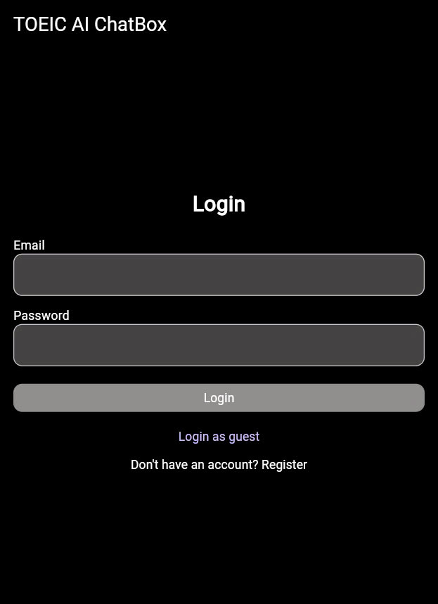
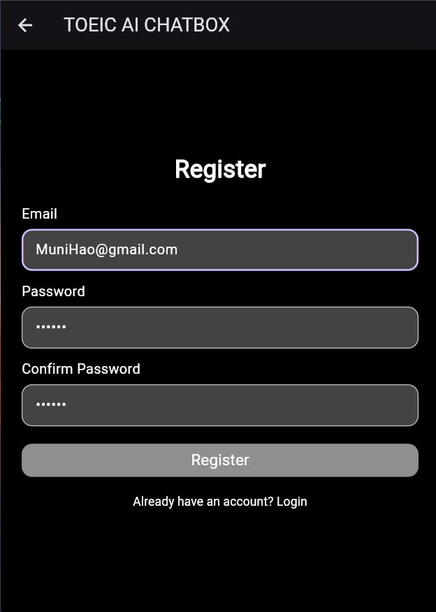
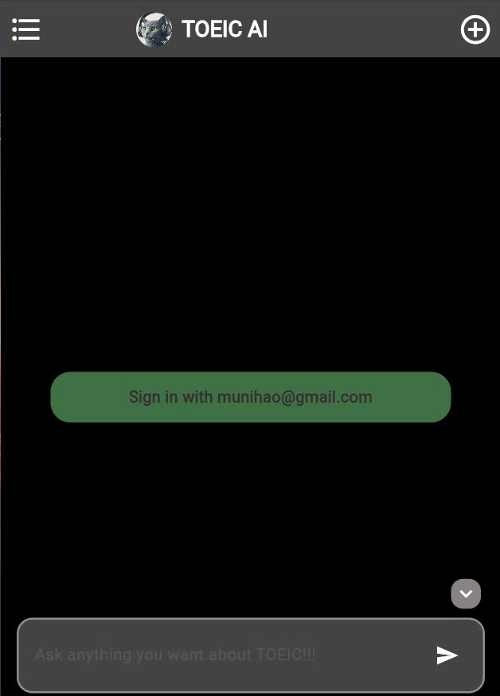
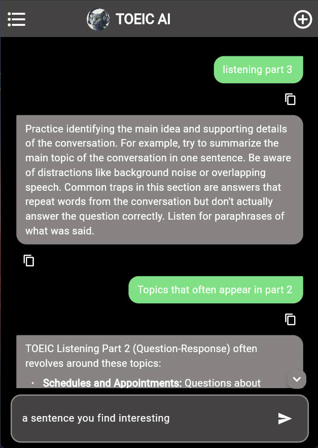
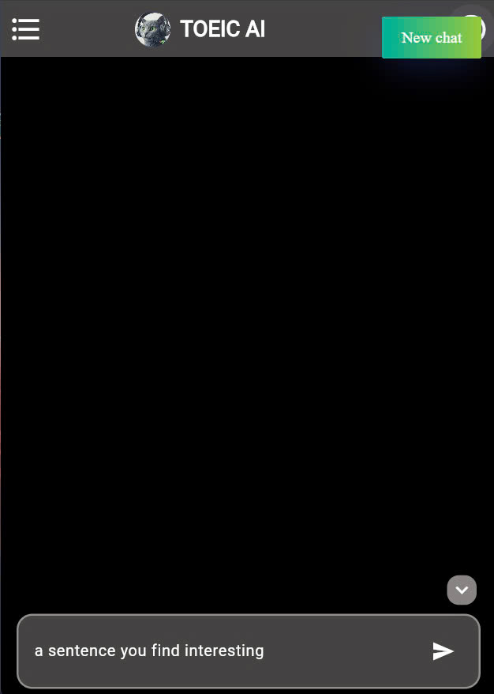
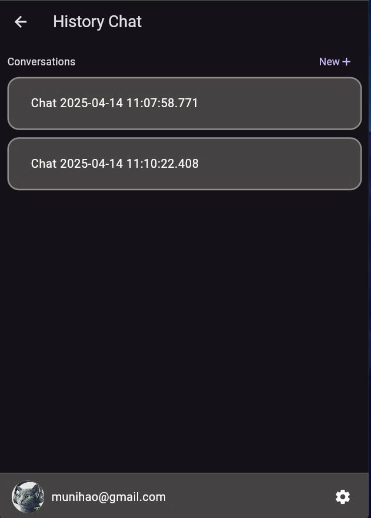
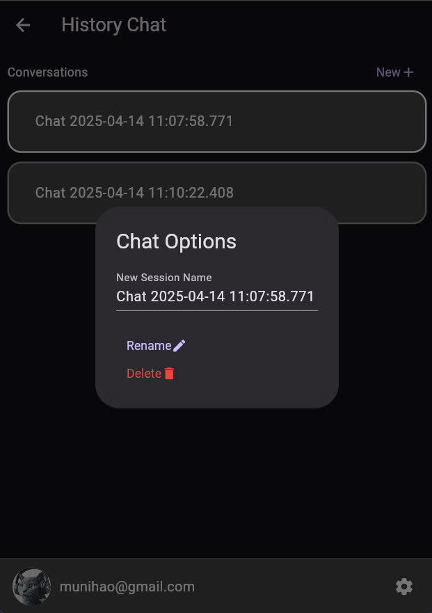
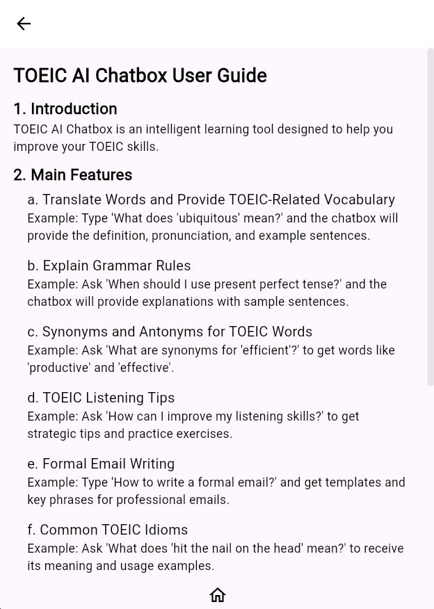

<!--
Course: CT312H-Mobile Programming.

Semester 2, Academic year: 2024-2025.

Student ID 1: B2111955

Student Name 1: Chau Dinh Thong

Student ID 2: B2110011

Student Name 2: Nguyen Nhat Hao 


Class Number: M01

https://gist.github.com/qoomon/5dfcdf8eec66a051ecd85625518cfd13
-->

# ChatWithToeicAI – Hive + Firebase Version

A chatbot mobile app that helps users practice TOEIC by chatting with AI.

> 🧪 This is an ongoing project – not yet deployed.

## 🚀 Features

- 💬 Chat-based TOEIC practice with Google Gemini AI
- 🔒 Firebase Authentication (email/password sign-in)
- 🔄 Firestore sync for user data and chat history
- 💾 Offline support via Hive (chat caching, local storage)
- ✨ Smooth page transitions and markdown-formatted responses

## 🛠️ Tech Stack

- **Flutter** + **Dart**
- **Firebase** (Auth, Firestore)
- **Hive** for local storage
- **Google Gemini API**

## 🖼️ Screenshots

<p align="center">
  
    
   <br/>
   
  
   <br/>
  
  
  
</p>

## 📦 Installation

```bash
git clone https://github.com/MuniHao/ChatWithToeicAI-Hive-Firebase.git
cd ChatWithToeicAI-Hive-Firebase
flutter pub get
```

## 🔑 Make sure to set up your firebase_options.dart and add your Google Gemini API key(dotenv).


```bash
flutter run
```

## 📍 Status
  - 🧩 **Still in development**

  - 📲 **Deployment not available yet**
